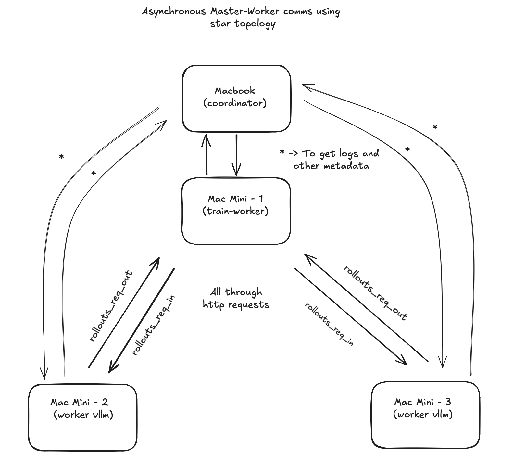
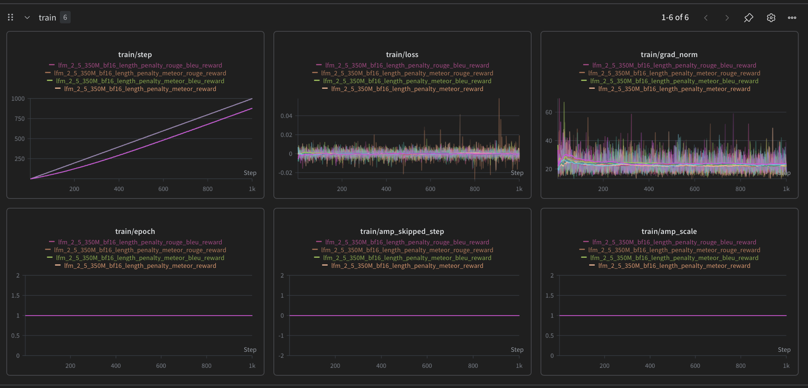
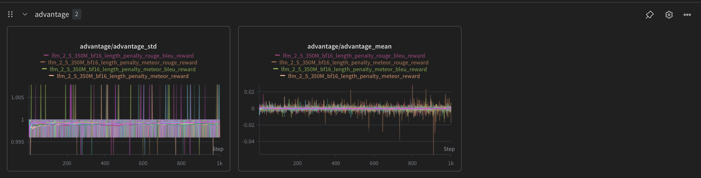
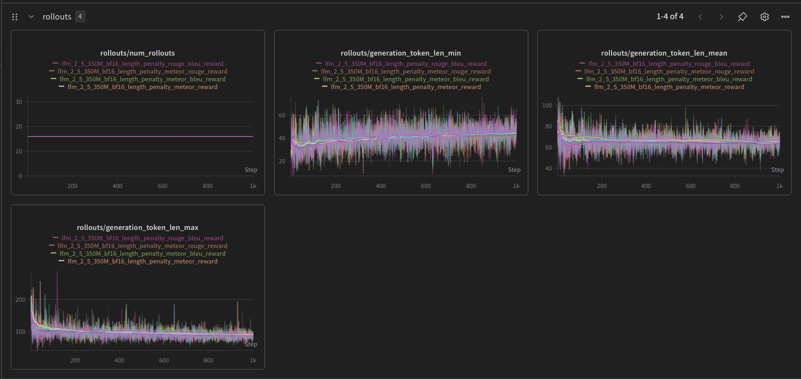
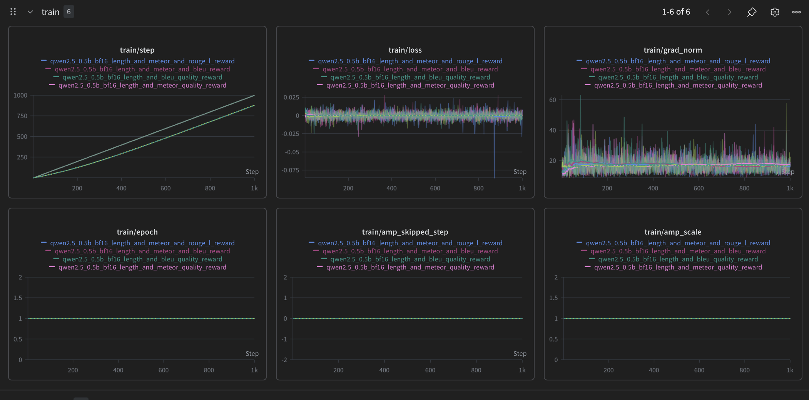
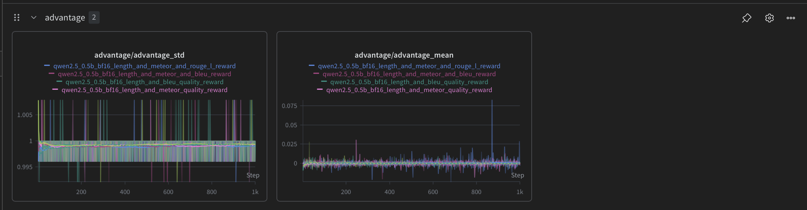
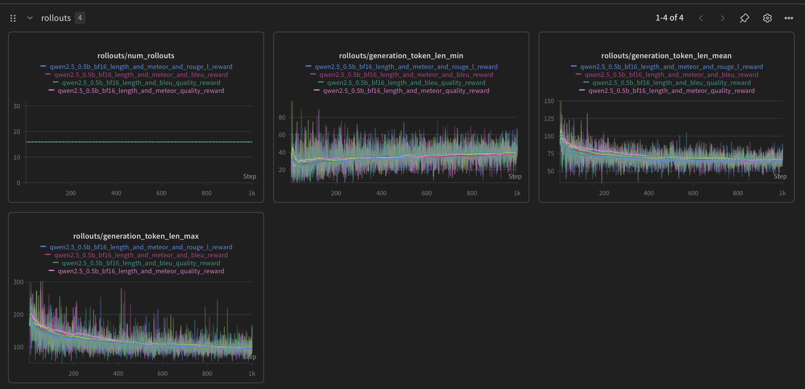
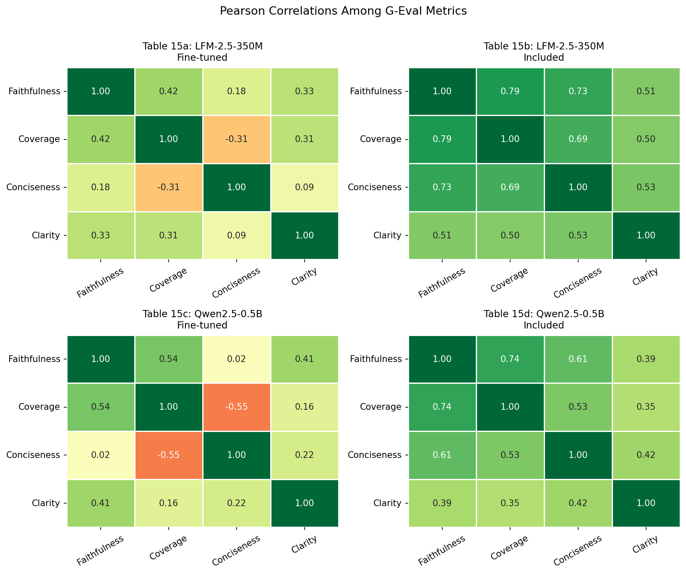
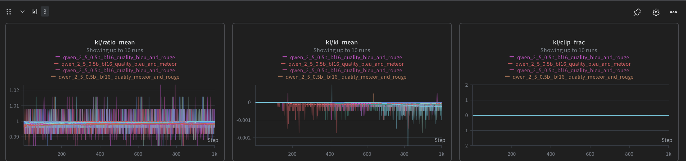
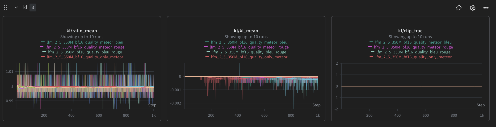

# Length-Constrained Summarization with GRPO: Ablating Reward Signals on [Reddit TL;DR](https://huggingface.co/datasets/mlabonne/smoltldr)

**Authors:** Yuvraj Singh · **Date:** May 2026 · **Reading time:** ~20 min

> **Abstract.** We ablate reward signals for GRPO summarization on [Reddit TL;DR](https://huggingface.co/datasets/mlabonne/smoltldr), targeting a **64-token** output budget across **Qwen2.5-0.5B** and **LFM-2.5-350M**. **Twelve reward configurations** *(six per strategy)* combine a length penalty with [ROUGE-L](#algorithm-1-1), [METEOR](#algorithm-1-1), [BLEU](#algorithm-1-1), and their pairings under two strategies: **length-penalty fine-tuned** *(starting from a length-pretrained 64-token checkpoint)* and **length-penalty included** *(including the length penalty directly in the reward function)*. Starting from a **length-penalty fine-tuned** checkpoint consistently outperforms the **length-penalty included** variant, with best G-Eval averages of ***2.904*** *(LFM)* and ***2.817*** *(Qwen)*. All experiments run on an **Apple Silicon 3x Mac mini M4 (2024, 16 GB each) cluster**.

## Table of Contents

1. [Introduction](#introduction)
2. [Task & Dataset](#task--dataset)
3. [Methods](#methods)
4. [Models](#models)
5. [Training Setup](#training-setup)
6. [Results](#results)
7. [Analysis & Discussion](#analysis--discussion)
8. [Limitations](#limitations)
9. [Future Work](#future-work)


## Introduction

Length control is a core challenge in text summarization: the right summary length depends on the source document, the application, and user preference - from a single sentence to several paragraphs. This matters most in constrained settings like fixed-width displays or strict token budgets, where quality and length accuracy must be met simultaneously.

Early work introduced length as an explicit parameter or embedding, but these approaches underperformed on quality metrics [[Kikuchi et al., 2016]](https://aclanthology.org/D16-1140/); [[Liu et al., 2018]](https://aclanthology.org/D18-1444/). Later methods discretize the target length into bins and condition generation on a bucket prefix or constraint signal, improving quality but sacrificing precise token-level control [[Fan et al., 2018]](https://aclanthology.org/W18-2706/); [[He et al., 2020]](https://arxiv.org/abs/2001.07331); [[Takase & Okazaki, 2019]](https://aclanthology.org/N19-1401/). A third line directly manipulates EOS token probabilities to steer length, but risks fluency degradation and coverage gaps [[Chan et al., 2021]](https://arxiv.org/abs/2108.02859); [[Liu et al., 2022]](https://arxiv.org/abs/2209.14672).

This work takes a different path: we express the length constraint as a **scalar reward signal** and train with **Group Relative Policy Optimization** (GRPO) [[Shao et al., 2024]](https://arxiv.org/abs/2402.03300), ablating it against **six lexical quality rewards** ([ROUGE-L](#algorithm-1-1), [METEOR](#algorithm-1-1), [BLEU](#algorithm-1-1) and their combinations) across two small open-weight models on [Reddit TL;DR](https://huggingface.co/datasets/mlabonne/smoltldr) summarization dataset, running end-to-end with a *single node training multi node* inference setup on Apple Silicon, using [smolcluster](https://github.com/mlabonne/smolcluster) to manage distributed rollout generation on vLLM workers.

## Task & Dataset

### The Summarization Task

The goal is compact, faithful summarization of Reddit posts - specifically, producing a summary of **exactly 64 tokens** or or close to 50 words, that captures the key points without introducing content not present in the source. This is a harder constraint than typical *abstractive summarization*: the model must simultaneously compress aggressively, preserve meaning, and respect a hard length budget.


### Dataset: Reddit TL;DR dataset -  smoltldr

All experiments use the [`mlabonne/smoltldr`](https://huggingface.co/datasets/mlabonne/smoltldr) dataset, a curated collection of Reddit posts paired with human-written TL;DR summaries.

*Table 1: smoltldr dataset split sizes.*

| Split | Examples |
|-------|:--------:|
| Train | **2,000** |
| Validation | **200** |
| Test | **200** |

All reported scores are computed on the **200-example test split**. Training uses the full train split for 1 epoch.

*Table 1b: Reference summary token distribution - `completion` column, model-native tokenizer, test split (n = 200).*

| Tokenizer | Mean | Std | Min | P50 | P90 | P95 | P99 | Max |
|-----------|-----:|----:|----:|----:|----:|----:|----:|----:|
| Qwen2.5-0.5B-Instruct | 25.2 | 2.1 | 21 | 25 | 28 | 29 | 32 | 36 |
| LFM-2.5-350M | 26.9 | 1.9 | 24 | 26 | 29 | 30 | 33 | 34 |

Reference summaries are extremely tight - P50 to P90 spans only 3-4 tokens for both tokenizers. This narrow target distribution makes the 64-token length reward a generous upper bound (~2.5× the reference length), giving the model room to be more thorough while still penalising runaway outputs.

*Table 1c: Raw Reddit post token distribution - `prompt` column, no system prompt, train split (n = 2000).*

| Tokenizer | Mean | Std | Min | P50 | P90 | P95 | P99 | Max |
|-----------|-----:|----:|----:|----:|----:|----:|----:|----:|
| Qwen2.5-0.5B-Instruct | 260.7 | 59.3 | 37 | 261 | 341 | 353 | 373 | 412 |
| LFM-2.5-350M | 272.8 | 60.8 | 43 | 272 | 355 | 368 | 386 | 414 |

No post exceeds 414 tokens raw, well within the `max_input_tokens: 512` budget even after the system prompt is prepended.

**Example inputs and targets** *(Table 2)*:

*Table 2: Sample dataset entries - Reddit post excerpts paired with human-written reference TL;DRs.*

| Subreddit | Post (truncated) | Reference TL;DR |
|-----------|-----------------|-----------------|
| r/tifu | Last night I went to a Hippie May Day Festival… my urge to pet this dog was immeasurable… My foot never saw it coming… impaled by what I would have thought was the devils pitchfork itself. The worst part is, I didn't even get to pet the dog. | Tried to pet a dog, foot got impaled by a demon stick, never even got to pet the dog. |
| r/relationships | My roommates bought 3 beta fish, 2 rats, and an elderly cat together but won't take care of any of them… rats out of food and water for 4 days, cat's litter full for a week… yet they spend $100+ on unnecessary stuff. My wife says stop helping - should I? | Roommates won't take care of their animals and I'm sick of doing it for them and I'm out of options. |

### Evaluation Protocol

Summaries are scored with **[LLM Evals (G-Eval)](https://deepeval.com/docs/metrics-llm-evals)** via DeepEval, using `gpt-5-mini-2025-08-07` as the judge. G-Eval is an LLM-as-a-judge framework that uses chain-of-thought reasoning to evaluate outputs against any custom criteria. <!-- TODO: verify this description --> Each example is evaluated across 5 independent rounds and scores are averaged. **Four** metrics are assessed (Table 3):

*Table 3: G-Eval evaluation metrics and what each measures.*

| Metric | What it measures |
|--------|-----------------|
| **Faithfulness** | Does the summary contain only information present in the source? |
| **Coverage** | Does the summary capture the key points of the source? |
| **Conciseness** | Is the summary free of unnecessary repetition and filler words? |
| **Clarity** | Is the summary well-formed and easy to read? |
| **Composite** | Sum of all four - maximum score of **4.0** |

Statistical significance is assessed using a **two-sided paired t-test** (n = 200, α = 0.05) on the **average score** (sum of all four G-Eval metric scores per example, averaged across 5 evaluation rounds). Each pair is one test example evaluated under both conditions.

> **Pass Rate** is the mean fraction of G-Eval evaluation rounds that passed per example, averaged across all 200 test examples (each example is evaluated over 5 rounds; DeepEval marks a round as passing when all four metric scores meet their thresholds).

### Pre-GRPO Baselines

Before any fine-tuning, we evaluate both models under zero-shot instruction following with two prompt-level length constraints (Table 4):

*Table 4: Pre-GRPO zero-shot baselines for both models under two prompt variants.*

| Model | Prompt | Composite | Faithfulness | Coverage | Conciseness | Clarity | Pass Rate |
|-------|--------|:---------:|:------------:|:--------:|:-----------:|:-------:|:---------:|
| Qwen2.5-0.5B | `baseline-50-words` | 2.376 | 0.698 | 0.415 | 0.571 | 0.693 | 21.0% |
| Qwen2.5-0.5B | `baseline-64-tokens` | 2.436 | 0.782 | 0.462 | 0.533 | 0.659 | 18.3% |
| LFM-2.5-350M | `baseline-50-words` | 2.332 | 0.549 | 0.304 | 0.823 | 0.656 | 13.4% |
| LFM-2.5-350M | `baseline-64-tokens` | 2.257 | 0.576 | 0.316 | 0.778 | 0.587 | 12.2% |

A two-sided paired t-test (n = 200) comparing `50-words` vs `64-tokens` within each model reveals that the models respond **differently to the length instruction wording** per metric out of the four defined above:

**Qwen2.5-0.5B** - individual metrics like `Faithfulness` and `Coverage` improve significantly with `64-tokens`, but cancel at the composite level (not significant) (Table 5).

*Table 5: Qwen2.5-0.5B - paired t-test comparing 50-words vs. 64-tokens prompt variants.*

| Metric | 50-words | 64-tokens | Δ | t | p |
|--------|:--------:|:---------:|:---:|------:|------:|
| Faithfulness | 0.6984 | 0.7820 | +0.0836 | 5.6600 | 5.23e-08 ✓ |
| Coverage | 0.4145 | 0.4620 | +0.0475 | 3.4397 | 7.09e-04 ✓ |
| Conciseness | 0.5706 | 0.5326 | −0.0380 | −2.2210 | 0.0275 ✓ |
| Clarity | 0.6927 | 0.6593 | −0.0334 | −3.2169 | 0.0015 ✓ |
| **Composite** | **2.3762** | **2.4359** | **+0.0597** | **1.6255** | **0.1056 ✗** |

**LFM-2.5-350M** - 50-words **wins significantly at the composite level**; 64-tokens hurts `Conciseness` and `Clarity` with no gain elsewhere (Table 6).

*Table 6: LFM-2.5-350M - paired t-test comparing 50-words vs. 64-tokens prompt variants.*

| Metric | 50-words | 64-tokens | Δ | t | p |
|--------|:--------:|:---------:|:---:|------:|------:|
| Faithfulness | 0.5490 | 0.5757 | +0.0267 | 1.6528 | 0.0999 ✗ |
| Coverage | 0.3042 | 0.3162 | +0.0120 | 1.3178 | 0.1891 ✗ |
| Conciseness | 0.8233 | 0.7782 | −0.0451 | −4.4114 | 1.68e-05 ✓ |
| Clarity | 0.6555 | 0.5870 | −0.0685 | −5.9349 | 1.29e-08 ✓ |
| **Composite** | **2.3320** | **2.2571** | **−0.0749** | **−2.4321** | **0.0159 ✓** |

These baselines serve as the reference point against which all GRPO-trained models are compared.

One common thing to note here for both the models, the metric `Faithfulness` and `Coverage` improve significantly with the `64-tokens` prompt variant, while `Conciseness` and `Clarity` degrade significantly. 

> Here, 'Δ' shows the mean difference in scores between the two prompt variants, so the one which is positive indicates which prompt variant performed better on average for that metric. 

## Methods

### GRPO Overview

Group Relative Policy Optimization (GRPO; [Shao et al., 2024](https://arxiv.org/abs/2402.03300)) is a reinforcement learning algorithm for language model fine-tuning that removes the need for a separate critic network. For each training prompt, a group of *G* completions is sampled from the current policy. The advantage of each completion is computed relative to the group:

$$A_i = \frac{r_i - \mu_{\text{group}}}{\sigma_{\text{group}}}$$

The policy is then updated to increase the probability of higher-advantage completions, clipped to a trust region. The full GRPO objective (Shao et al., 2024) averages the clipped surrogate per-token and per-group, and adds an optional KL penalty against a frozen reference policy:

$$\mathcal{L}_{\text{GRPO}}(\theta) = -\mathbb{E}\!\left[\frac{1}{G}\sum_{i=1}^{G}\frac{1}{|o_i|}\sum_{t=1}^{|o_i|}\!\left(\min\!\left(r_{i,t}\,\hat{A}_i,\ \text{clip}(r_{i,t},1{-}\varepsilon,1{+}\varepsilon)\,\hat{A}_i\right) - \beta\,\mathbb{D}_{\text{KL}}\!\left[\pi_\theta\,\|\,\pi_{\text{ref}}\right]\right)\right]$$

where the per-token importance-sampling ratio is $r_{i,t} = \dfrac{\pi_\theta(o_{i,t}\mid q,o_{i,<t})}{\pi_{\text{old}}(o_{i,t}\mid q,o_{i,<t})}$, $\varepsilon$ is the clip ratio, and $\beta$ is the KL penalty coefficient.

In the implementation, `compute_logprobs` averages over completion tokens first, reducing each rollout to a single scalar before the group averaging and clipping happen - matching the $\frac{1}{|o_i|}$ term analytically.

Because advantages are group-relative, GRPO is sensitive to within-group variance. If all rollouts in a group receive similar rewards, the normalized advantages collapse toward zero and the gradient signal vanishes - a dynamic that will be visible in the training curves.


### Reward Signals
---

Two categories of reward signals are tested: a length penalty to enforce the 64-token constraint, and lexical overlap metrics to encourage quality against the reference summary.

#### 1. Length Penalty

The length reward penalizes deviation from a target of **64 tokens**:

$$r_{\text{length}}(\hat{y}) = -\frac{|\text{tokens}(\hat{y}) - 64|}{64} \quad \in (-1,\, 0]$$

A perfect 64-token output receives 0.0; every token of deviation costs 1/64. Critically, the penalty is **symmetric** - outputs longer than 64 tokens are penalized equally to outputs shorter than 64 tokens, so there is no reward incentive to dump padding tokens.

#### 2. Quality Metrics

Three lexical overlap metrics are used as quality reward signals (Table 7):

*Table 7: Lexical overlap metrics used as quality reward signals.*

| Signal | Range | What it measures |
|--------|:-----:|-----------------|
| [**BLEU**](#algorithm-1-1) | [0, 1] | n-gram precision of prediction vs. reference |
| [**ROUGE-L**](#algorithm-1-1) | [0, 1] | Longest common subsequence F1 vs. reference |
| [**METEOR**](#algorithm-1-1) | [0, 1] | Precision/recall with stemming and synonym matching |

All three are computed against the human-written reference summary in the dataset. The total reward for a given completion is the sum of all enabled signals.

<a id="algorithm-1-1"></a>

> **Algorithm 1.1 - Quality Reward Signal Formulas**
>
> **ROUGE-L**
> $$\text{ROUGE-L} = \frac{(1 + \beta^2) \cdot P \cdot R}{R + \beta^2 \cdot P}$$
> where $P$ is precision and $R$ is recall of the longest common subsequence against the reference summary.
>
> **METEOR**
> $$\text{METEOR} = F_{\text{mean}} \cdot (1 - P_{\text{frag}})$$
> where $F_{\text{mean}}$ is the harmonic mean of unigram precision and recall (with stemming and synonym matching), and $P_{\text{frag}}$ is a fragmentation penalty based on how contiguous the matched chunks are.
>
> **BLEU**
> $$\text{BLEU} = \text{BP} \cdot \exp\!\left(\sum_{n=1}^{N} w_n \log p_n\right)$$
> where $\text{BP}$ is a brevity penalty that discounts outputs shorter than the reference, and $p_n$ is the modified n-gram precision for order $n$.


### Training Strategies

---

We test two strategies for combining the length penalty with quality metrics:

**Strategy 1 - Length-Penalty Fine-tuned (staged curriculum learning)**

Training proceeds in two stages:
- **Stage 1:** Length-penalty reward only. The model is trained to produce outputs near 64 tokens.
- **Stage 2:** Quality reward(s) only - length penalty is removed. Starting from the length-conditioned checkpoint, the model is optimized for lexical quality against the reference.

The hypothesis is that pre-conditioning on length frees the quality stage to focus on content without simultaneously fighting length drift.

**Strategy 2 - Length-Penalty Included (joint training)**

Length penalty and quality reward(s) are active simultaneously from the first step. The model must balance both objectives throughout training. Six quality reward configurations are tested under each strategy (Table 8):

*Table 8: Reward configurations tested under each training strategy.*

| Configuration | Signals |
|---------------|---------|
| `bleu` | [BLEU](#algorithm-1-1) only |
| `rouge` / `rouge-l` | [ROUGE-L](#algorithm-1-1) only |
| `meteor` | [METEOR](#algorithm-1-1) only |
| `meteor-bleu` | [METEOR](#algorithm-1-1) + [BLEU](#algorithm-1-1) |
| `bleu-rouge` | [BLEU](#algorithm-1-1) + [ROUGE-L](#algorithm-1-1) |
| `meteor-rouge` | [METEOR](#algorithm-1-1) + [ROUGE-L](#algorithm-1-1) |

This gives **6 configurations × 2 strategies × 2 models = 24 fine-tuned checkpoints**, plus the length-only checkpoint used as the GRPO baseline for each model.


## Models

Both models are small, instruction-tuned, and quantized to bfloat16 - targeting deployment on resource-constrained hardware.

#### Qwen2.5-0.5B-Instruct-bf16

- **Architecture:** Qwen2.5 transformer, 0.5B parameters
- **Source:** [`mlx-community/Qwen2.5-0.5B-Instruct-bf16`](https://huggingface.co/mlx-community/Qwen2.5-0.5B-Instruct-bf16)
- **Format:** bfloat16 weights, MLX-native

#### LFM-2.5-350M-bf16

- **Architecture:** LFM-2.5 (Liquid Foundation Model), 350M parameters
- **Source:** [`mlx-community/LFM-2.5-350M-bf16`](https://huggingface.co/mlx-community/LFM-2.5-350M-bf16)
- **Format:** bfloat16 weights, MLX-native

Both models are fine-tuned from the instruction-tuned variants (not base models) as the instruction tuning provides the pretrained language prior that, as discussed in the analysis, plays a significant role in training stability.


## Training Setup

### Hardware

All training runs on **Apple Silicon** using [MLX](https://github.com/ml-explore/mlx), Apple's array framework for unified-memory hardware. Rollout generation is offloaded to distributed **vLLM** workers via the [`smolcluster`](https://github.com/YuvrajSingh9886/smolcluster) framework, which manages multi-node rollout distribution and weight synchronization.



### GRPO Hyperparameters

The following hyperparameters are fixed across all runs (Table 9):

*Table 9: Fixed GRPO hyperparameters shared across all experiments.*

| Hyperparameter | Value |
|----------------|:-----:|
| Learning rate | 2e-6 |
| Optimizer | Adam |
| Batch size | 2 |
| Gradient accumulation steps | 1 |
| Max grad norm | 1.0 |
| Clip ratio (ε) | 0.2 |
| KL beta (β) | 0.0001 |
| Rollouts per prompt per worker | 4 |
| Max input tokens | 512 |
| Max output tokens | 512 |
| Training epochs | 1 |
| Dtype | bfloat16 |
| LoRA | disabled (full bf16 params) |

> - **On KL:** `use_kl: true` loads a **second, frozen copy** of the initial model (`ref_model`) to compute `ref_logprobs` for the KL penalty term $\beta\,\mathbb{D}_{\text{KL}}[\pi_\theta\|\pi_{\text{ref}}]$. This doubles parameter memory - a meaningful cost at 12 GB of memeory I had on my mac mini. 
> - `π_old` (the IS ratio denominator) is **not** from vLLM; it is computed locally by scoring the rollout text through the training model before each gradient update, then snapshotted. With β = 0.0001 the KL term contributes negligibly to the loss - the primary regularizer is the clip ratio (ε = 0.2) and gradient norm clipping.


### Single-Node Training with Multi-Node Inferencing


This project uses a **hybrid approach** on a single Apple Silicon machine. An MLX training process handles the forward/backward pass; a separate vLLM server process handles all sampling. 


> - In **synchronous** distributed training, rollout generation (inference) and policy update (gradient computation) are strictly sequential - generate rollouts, wait, compute gradients, update weights, repeat. The GPU sits idle during inference and the inference server sits idle during the backward pass.

> - **Asynchronous** training breaks this dependency: while the GPU is computing gradients for step N, the inference server is already generating rollouts for step N+1 in the background. The two overlap in time, hiding inference latency behind compute.

#### 1. Weight Synchronization

Checkpoints are saved every 100 optimizer steps and synced to the vLLM workers every 5 training steps, ensuring rollouts are generated from a policy that is at most 5 steps stale.

This is a critical detail for GRPO training stability - if rollouts are generated from a policy that is too stale, the advantage estimates become inaccurate and the training signal degrades. The 5-step sync interval strikes a balance between rollout freshness and training throughput.

> - Now, I know what you must be thinking, *"wait there is staleness which makes it off policy!"* - well yes, this is asynchronous distributed training. The staleness factor is controlled by `clip_ratio` and `kl_beta`, which limit how much the policy can shift away from the rollout policy in a single step. With a clip ratio of 0.2 and a small KL beta, the model can only make gradual updates that keep it close to the rollout policy, mitigating the impact of staleness on training stability.

> - By weighting the rollouts according to their likelihood under the current policy, we can mitigate the impact of stale rollouts on training stability.

#### 2. Rollout Generation

Rollouts are generated by remote vLLM servers (one per worker node) via HTTP, with `prefetch_rollouts: true` to overlap rollout generation with the gradient computation of the previous step. Each prompt receives rollouts from all workers, giving an effective group size proportional to `num_rollouts × num_workers`.

#### 3. Fitting GRPO in 12 GB of Unified Memory

Running a full GRPO loop - policy model, optional reference model, activations, gradients, and optimizer state - on a 12 GB Apple Silicon chip requires several coordinated memory reduction techniques. Below are the ones actually present in the code:

- **bfloat16 throughout.** Both the policy and reference models are loaded in bfloat16. At 0.5B and 350M parameters this gives ≈1 GB and ≈0.7 GB respectively, roughly half the cost of float32. All forward passes and gradient computations stay in bf16.

- **Chunked gradient accumulation over T × C.** The most impactful trick. Rather than materializing activations for all T prompts × C rollouts simultaneously during the backward pass, the training loop iterates over `chunk_T × rollout_chunk` sub-slices and accumulates gradients across chunks:

```python
for t_start in range(0, T, chunk_T):
    for rc_start in range(0, C, rollout_chunk):
        chunk_loss, chunk_grads = nn.value_and_grad(model, chunk_loss_fn)(model)
        mx.eval(chunk_loss, chunk_grads)   # materialise → free the lazy graph
        accum_grads = _add_grads(accum_grads, chunk_grads)
        mx.eval(accum_grads)               # free the addition graph
```

Only one chunk's activations live in memory at any moment. `mx.eval()` after each chunk forces MLX's lazy evaluator to execute and free the intermediate computation graph before the next chunk begins.

- **Gradient checkpointing.** When `grad_checkpoint: true` is set, `compute_logprobs` wraps the forward pass with MLX's `mlx_grad_checkpoint`, recomputing activations during the backward pass instead of storing them. Trades some extra FLOPs for a proportional reduction in peak activation memory.

- **Remote rollout generation.** The Mac never runs inference. All sampling is done by remote vLLM workers; only text is returned over HTTP.

- **Two model copies in memory (`use_kl: true`).** All experiments ran with `use_kl: true`, which loads a frozen copy of the initial model alongside the policy - doubling the parameter footprint (≈2 GB for Qwen, ≈1.4 GB for LFM at bf16). This is the single largest fixed memory cost. Setting `use_kl: false` eliminates it entirely when the clip ratio alone provides sufficient regularization.

- **Rollout prefetching in a background thread.** `RolloutPrefetcher` fires the next step's HTTP rollout request in a background thread the moment the current step's gradient computation starts. This means rollout payloads are never buffered for more than one step ahead, bounding the network receive buffer to a single batch of text, while overlapping rollout generation while further computations (forward + backward passes) happen to maximize throughput.


## Results

### 1. LFM-2.5-350M - using Length-Penalty Fine-tuned

All six quality reward configurations improve significantly over this baseline, where a checkpoint already tuned with `length-penalty` is used (Table 10).

*Table 10: LFM-2.5-350M - Length-Penalty Fine-tuned results per reward configuration. Significance: two-sided paired t-test vs. `length-only` baseline on average score (n = 200, α = 0.05).*

| Reward Configuration | Average | Faithfulness | Coverage | Conciseness | Clarity | Pass Rate | ΔAverage | t | p | Sig |
|----------------------|:-------:|:------------:|:--------:|:-----------:|:-------:|:---------:|:--------:|------:|------:|:---:|
| `length-only` (GRPO baseline) | 2.233 | 0.627 | 0.378 | 0.554 | 0.674 | 24.6% | - | - | - | - |
| `quality-rouge` | 2.659 | 0.852 | 0.262 | 0.847 | 0.698 | 8.4% | +0.4263 | 9.7962 | 9.66e-19 | ✓ |
| `quality-meteor` ⭐ | **2.904** | 0.902 | 0.569 | 0.662 | 0.771 | **51.8%** | +0.6712 | 15.1589 | 5.16e-35 | ✓ |
| `quality-bleu` | 2.790 | 0.899 | 0.514 | 0.603 | **0.774** | 37.9% | +0.5571 | 12.4550 | 1.05e-26 | ✓ |
| `quality-meteor-bleu` | 2.878 | 0.901 | **0.611** | 0.597 | 0.769 | 46.6% | +0.6448 | 14.8908 | 3.44e-34 | ✓ |
| `quality-meteor-rouge` | 2.840 | **0.918** | 0.506 | 0.704 | 0.711 | 43.3% | +0.6073 | 13.5378 | 5.00e-30 | ✓ |
| `quality-bleu-rouge` | 2.726 | 0.887 | 0.275 | **0.841** | 0.723 | 9.1% | +0.4931 | 11.2246 | 5.74e-23 | ✓ |

All six configurations achieve significance at *p < 0.001*. `quality-meteor` is the best overall (average *2.904*, 5/5 metrics significant).

*Table 10a: Output token distribution per reward configuration - LFM-2.5-350M Length-Penalty Fine-tuned rollouts (n = 200 test examples, model-native tokenizer). Within ±5 of 64 tok = 59–69 token range.*

| Reward Configuration | Mean | Std | Min | P50 | P90 | P95 | P99 | Max | Within ±5 of 64 |
|----------------------|-----:|----:|----:|----:|----:|----:|----:|----:|:---------------:|
| `quality-rouge` | 27.9 | 8.9 | 12 | 27 | 38 | 43 | 50 | 84 | 0/200 (0%) |
| `quality-meteor` | 123.7 | 25.0 | 71 | 124 | 155 | 166 | 178 | 219 | 0/200 (0%) |
| `quality-bleu` | 127.6 | 28.9 | 66 | 126 | 160 | 174 | 211 | 272 | 2/200 (1%) |
| `quality-meteor-bleu` | 130.2 | 27.2 | 59 | 130 | 166 | 176 | 183 | 198 | 4/200 (2%) |
| `quality-meteor-rouge` | 71.9 | 20.0 | 29 | 72 | 94 | 108 | 135 | 149 | 44/200 (22%) |
| `quality-bleu-rouge` | 32.4 | 13.0 | 10 | 29 | 50 | 58 | 67 | 84 | 8/200 (4%) |


### 2. LFM-2.5-350M - Length-Penalty Included

With length and quality rewards active simultaneously, the picture is more differentiated. Only 4 of 6 configurations achieve a significant average improvement; `length-quality-rouge` and `length-quality-bleu` fall short (Table 11).

*Table 11: LFM-2.5-350M - Length-Penalty Included results per reward configuration. Significance: two-sided paired t-test vs. `length-only` baseline on average score (n = 200, α = 0.05).*

| Reward Configuration | Average | Faithfulness | Coverage | Conciseness | Clarity | Pass Rate | ΔAverage | t | p | Sig |
|----------------------|:-------:|:------------:|:--------:|:-----------:|:-------:|:---------:|:--------:|------:|------:|:---:|
| `length-only` (GRPO baseline) | 2.233 | 0.627 | 0.378 | 0.554 | 0.674 | 24.6% | - | - | - | - |
| `length-quality-rouge` | 2.278 | 0.642 | 0.414 | 0.575 | 0.646 | 30.1% | +0.0451 | 0.9882 | 0.3242 | ✗ |
| `length-quality-meteor` | 2.358 | 0.689 | 0.433 | 0.595 | 0.641 | 32.5% | +0.1253 | 2.5280 | 0.0122 | ✓ |
| `length-quality-bleu` | 2.243 | 0.620 | 0.401 | 0.556 | 0.665 | 26.7% | +0.0100 | 0.2182 | 0.8275 | ✗ |
| `length-quality-meteor-bleu` | 2.377 | 0.696 | 0.451 | 0.595 | 0.634 | 34.2% | +0.1440 | 2.8426 | 0.0049 | ✓ |
| `length-quality-meteor-rouge` ⭐ | **2.701** | **0.834** | **0.493** | **0.685** | **0.690** | **45.2%** | +0.4685 | 10.5579 | 5.63e-21 | ✓ |
| `length-quality-bleu-rouge` | 2.387 | 0.696 | 0.443 | 0.606 | 0.643 | 35.4% | +0.1541 | 3.2827 | 0.0012 | ✓ |

`length-quality-meteor-rouge` is the clear outlier - it achieves average *2.701* (*+0.4685*), while the next best is *2.387* (*+0.1541*).

*Table 11a: Output token distribution per reward configuration - LFM-2.5-350M Length-Penalty Included rollouts (n = 200 test examples, model-native tokenizer). Within ±5 of 64 tok = 59–69 token range.*

| Reward Configuration | Mean | Std | Min | P50 | P90 | P95 | P99 | Max | Within ±5 of 64 |
|----------------------|-----:|----:|----:|----:|----:|----:|----:|----:|:---------------:|
| `length-only` (baseline) | 70.1 | 11.8 | 44 | 69 | 86 | 92 | 101 | 105 | 71/200 (35%) |
| `length-quality-rouge` | 68.1 | 11.8 | 42 | 67 | 85 | 88 | 96 | 112 | 74/200 (37%) |
| `length-quality-meteor` | 69.7 | 13.6 | 42 | 69 | 84 | 92 | 107 | 124 | 64/200 (32%) |
| `length-quality-bleu` | 71.6 | 13.3 | 42 | 71 | 89 | 93 | 109 | 114 | 59/200 (29%) |
| `length-quality-meteor-bleu` | 70.8 | 13.7 | 43 | 70 | 88 | 94 | 100 | 114 | 60/200 (30%) |
| `length-quality-meteor-rouge` | 71.5 | 14.7 | 37 | 72 | 90 | 96 | 109 | 113 | 49/200 (24%) |
| `length-quality-bleu-rouge` | 68.8 | 12.9 | 39 | 67 | 85 | 94 | 106 | 108 | 74/200 (37%) |

### 1. Qwen2.5-0.5B - Length-Penalty Fine-tuned

The length-only GRPO baseline for Qwen is *2.416*. Five of six configurations improve significantly; `quality-bleu` alone fails to reach significance *(p = 0.9825)* (Table 12).

*Table 12: Qwen2.5-0.5B - Length-Penalty Fine-tuned results per reward configuration. Significance: two-sided paired t-test vs. `length-only` baseline on average score (n = 200, α = 0.05).*

| Reward Configuration | Average | Faithfulness | Coverage | Conciseness | Clarity | Pass Rate | ΔAverage | t | p | Sig |
|----------------------|:-------:|:------------:|:--------:|:-----------:|:-------:|:---------:|:--------:|------:|------:|:---:|
| `length-only` (GRPO baseline) | 2.416 | 0.678 | 0.407 | 0.592 | 0.739 | 30.7% | - | - | - | - |
| `quality-rouge` | 2.777 | 0.818 | 0.338 | 0.841 | 0.779 | 19.6% | +0.3612 | 6.4554 | 8.07e-10 | ✓ |
| `quality-meteor` | 2.697 | 0.883 | 0.619 | 0.444 | 0.751 | 30.5% | +0.2818 | 5.0536 | 9.79e-07 | ✓ |
| `quality-bleu` | 2.414 | 0.722 | 0.439 | 0.575 | 0.678 | 32.1% | −0.0013 | −0.0220 | 0.9825 | ✗ |
| `quality-meteor-bleu` | 2.734 | **0.933** | **0.716** | 0.322 | **0.763** | 26.1% | +0.3187 | 6.0349 | 7.65e-09 | ✓ |
| `quality-meteor-rouge` | 2.796 | 0.853 | 0.489 | 0.692 | 0.762 | **38.3%** | +0.3808 | 6.7336 | 1.73e-10 | ✓ |
| `quality-bleu-rouge` ⭐ | **2.817** | 0.865 | 0.329 | **0.839** | 0.784 | 18.2% | +0.4018 | 7.1184 | 1.94e-11 | ✓ |

`quality-meteor-bleu` achieves the highest `Faithfulness` *(0.933)* and `Coverage` *(0.716)* of any Qwen configuration, but `Conciseness` regresses sharply *(0.322)* - the model produces longer, more faithful outputs at the cost of brevity. `quality-bleu-rouge` and `quality-rouge` flip this: high `Conciseness`, `Coverage` not significant.

*Table 12a: Output token distribution per reward configuration - Qwen2.5-0.5B Length-Penalty Fine-tuned rollouts (n = 200 test examples, model-native tokenizer). Within ±5 of 64 tok = 59–69 token range.*

| Reward Configuration | Mean | Std | Min | P50 | P90 | P95 | P99 | Max | Within ±5 of 64 |
|----------------------|-----:|----:|----:|----:|----:|----:|----:|----:|:---------------:|
| `quality-rouge` | 31.9 | 11.6 | 8 | 29 | 47 | 55 | 64 | 73 | 4/200 (2%) |
| `quality-meteor` | 100.9 | 45.1 | 27 | 90 | 153 | 185 | 265 | 294 | 30/200 (15%) |
| `quality-bleu` | 70.4 | 20.0 | 28 | 70 | 93 | 101 | 124 | 149 | 33/200 (16%) |
| `quality-meteor-bleu` | 123.8 | 61.7 | 29 | 112 | 207 | 223 | 290 | 512 | 18/200 (9%) |
| `quality-meteor-rouge` | 65.8 | 28.8 | 23 | 62 | 96 | 106 | 152 | 294 | 42/200 (21%) |
| `quality-bleu-rouge` | 34.0 | 14.2 | 8 | 32 | 52 | 61 | 71 | 95 | 8/200 (4%) |

### 2. Qwen2.5-0.5B - Length-Penalty Included

*Table 13: Qwen2.5-0.5B - Length-Penalty Included results per reward configuration. Significance: two-sided paired t-test vs. `length-only` baseline on average score (n = 200, α = 0.05).*

| Reward Configuration | Average | Faithfulness | Coverage | Conciseness | Clarity | Pass Rate | ΔAverage | t | p | Sig |
|----------------------|:-------:|:------------:|:--------:|:-----------:|:-------:|:---------:|:--------:|------:|------:|:---:|
| `length-only` (GRPO baseline) | 2.416 | 0.678 | 0.407 | 0.592 | 0.739 | 30.7% | - | - | - | - |
| `length-quality-rouge-l` | 2.555 | 0.725 | 0.415 | 0.637 | 0.778 | 32.4% | +0.1392 | 2.6594 | 0.0085 | ✓ |
| `length-quality-meteor` | 2.484 | 0.721 | 0.427 | 0.625 | 0.711 | 33.1% | +0.0688 | 1.2540 | 0.2113 | ✗ |
| `length-quality-bleu` | 2.400 | 0.680 | 0.399 | 0.577 | 0.744 | 26.9% | −0.0153 | −0.2927 | 0.7701 | ✗ |
| `length-quality-meteor-bleu` | 2.664 | 0.792 | 0.468 | 0.648 | 0.756 | 38.3% | +0.2489 | 4.3514 | 2.16e-05 | ✓ |
| `length-quality-meteor-rouge` ⭐ | **2.769** | **0.832** | **0.511** | **0.659** | **0.767** | **44.3%** | +0.3530 | 6.3615 | 1.35e-09 | ✓ |
| `length-quality-bleu-rouge` | 2.732 | 0.810 | 0.502 | 0.650 | **0.770** | 39.1% | +0.3161 | 5.3205 | 2.77e-07 | ✓ |

`length-quality-meteor-rouge` is the only configuration achieving 5/5 metric significance (Table 13). `length-quality-bleu` is the only configuration where **0/5** individual metrics are significant - BLEU-only reward provides no measurable quality signal for Qwen under joint training.

*Table 13a: Output token distribution per reward configuration - Qwen2.5-0.5B Length-Penalty Included rollouts (n = 200 test examples, model-native tokenizer). Within ±5 of 64 tok = 59–69 token range.*

| Reward Configuration | Mean | Std | Min | P50 | P90 | P95 | P99 | Max | Within ±5 of 64 |
|----------------------|-----:|----:|----:|----:|----:|----:|----:|----:|:---------------:|
| `length-only` (baseline) | 65.4 | 15.9 | 32 | 64 | 86 | 94 | 110 | 114 | 61/200 (30%) |
| `length-quality-rouge-l` | 62.9 | 16.9 | 29 | 61 | 85 | 95 | 106 | 131 | 55/200 (27%) |
| `length-quality-meteor` | 67.2 | 18.2 | 28 | 65 | 91 | 99 | 126 | 157 | 55/200 (27%) |
| `length-quality-bleu` | 67.2 | 16.7 | 31 | 64 | 91 | 99 | 109 | 126 | 55/200 (27%) |
| `length-quality-meteor-bleu` | 68.5 | 18.8 | 29 | 66 | 96 | 104 | 120 | 129 | 62/200 (31%) |
| `length-quality-meteor-rouge` | 69.5 | 20.3 | 34 | 67 | 96 | 110 | 122 | 161 | 42/200 (21%) |
| `length-quality-bleu-rouge` | 71.0 | 26.6 | 29 | 66 | 102 | 112 | 158 | 271 | 49/200 (24%) |

### Cross-Model Analysis

---

#### 1. Fine-tuned Strategy (Tables 10 & 12)

Without the length penalty during fine-tuning, output **lengths diverge sharply** across both models, with a consistent **declining pattern** in `Coverage` across reward configurations.

The reason lies in the formulation of the [`ROUGE-L`](#algorithm-1-1), [`METEOR`](#algorithm-1-1), and [`BLEU`](#algorithm-1-1) rewards:

- One notable constrast with the ```length penalty fine-tuned``` variant is the ```Average``` scores are generally higher for Qwen than LFM across the board,indicating the effectivensss of the use of starting off with a fine tuned checkpoint and further tuning it with quality rewards.
- There is no active reward for length in this strategy, so the model is free to optimize for quality without any constraint on output length.
- `BLEU`'s brevity penalty penalizes outputs shorter than the reference, encouraging longer outputs. Configurations containing `BLEU` (`quality-bleu`, `quality-meteor-bleu`) produce much longer outputs *(P50 of ~112-130 tokens)* across both models, except `quality-bleu-rouge` *(P50 of 29-32 tokens)* where ROUGE-L's precision term pulls length back down.
- [`ROUGE-L`](#algorithm-1-1) and [`METEOR`](#algorithm-1-1) reward recall, which does not directly incentivize longer outputs on their own.

- No single configuration dominates all four metrics in either model - the highest score for each metric is owned by a different configuration.
- We especially focus on `Coverage`, which shows the **sharpest variance**: from *0.262* (`quality-rouge`, LFM) to *0.611* (`quality-meteor-bleu`, LFM), and *0.329* (`quality-bleu-rouge`, Qwen) to *0.716* (`quality-meteor-bleu`, Qwen). Since reference summaries are very short *(P50 of 25-26 tokens)*, longer model outputs *(P50 of 27-130 tokens)* can cover more ground but at the cost of `Conciseness` - more severe for Qwen, where `quality-meteor-bleu` drops `Conciseness` to *0.322* vs *0.597* for LFM.
- One key divergence between the models: **BLEU provides no measurable signal for Qwen** (`quality-bleu` *p = 0.9825*, essentially zero effect), while LFM gains a solid *+0.557* from it. The best fine-tuned config also differs - `quality-meteor` for LFM, `quality-bleu-rouge` for Qwen.

Different reward configurations therefore suit different evaluation priorities - if `Faithfulness` is paramount, `quality-meteor-rouge` leads in both models; if `Conciseness` matters more, `quality-bleu-rouge` is the best choice across both.

#### 2. Length-Penalty Included Strategy (Tables 11 & 13)

With length and quality rewards active simultaneously, all configurations stay tightly clustered around the 64-token target across both models (LFM: *68-72 tok mean*, 24-37% within ±5; Qwen: *63-71 tok mean*, 21-31% within ±5) - a direct contrast to the fine-tuned case above.

- The best configuration in both models is `length-quality-meteor-rouge`, with *(P50 of 72 tokens)* (LFM) and *(P50 of 67 tokens)* (Qwen) - much closer to the reference *(P50 of 25-26 tokens)* than the fine-tuned case where *P50 values ranged from 27 to 130 tokens*.
- `Coverage` no longer shows the erratic, sharp decline: the range narrows to *0.414-0.493* (LFM) and *0.399-0.511* (Qwen), compared to swings of *0.262-0.611* and *0.329-0.716* without the length constraint. This gradual, consistent improvement across metrics suggests the length constraint forces the model to be simultaneously concise and covering, resolving the tradeoff rather than letting it pick one at the cost of the other.
- This means the reward configurations, constrained by the length penalty, helped to mitigate the sharp `Coverage` decline seen in the fine-tuned case - a case of *preventing* reward hacking by anchoring the optimization space.
- `BLEU`-only (`length-quality-bleu`) fails significance in both models (LFM: *p = 0.8275*; Qwen: *p = 0.7701*), confirming BLEU alone provides no usable quality gradient under joint training.
- Pass Rates are broadly higher across more configurations under joint training, with the best configs reaching 45.2% (LFM) and 44.3% (Qwen), suggesting more consistent quality improvements across the board rather than a single outlier config carrying the result.


### Training Dynamics

---

**LFM-2.5-350M**


<p><strong>Figure 3a</strong> — LFM-2.5-350M: <code>train/step</code>, <code>train/loss</code>, <code>grad_norm</code>, <code>epoch</code>, <code>amp_skipped_step</code>, <code>amp_scale</code> across reward configurations, length-penalty-included strategy (W&amp;B).</p>


<p><strong>Figure 3b</strong> — LFM-2.5-350M: <code>advantage_std</code> and <code>advantage_mean</code> across reward configurations, length-penalty-included strategy (W&amp;B).</p>


<p><strong>Figure 3c</strong> — LFM-2.5-350M: <code>num_rollouts</code>, <code>generation_token_len_{min,mean,max}</code> across reward configurations, length-penalty-included strategy (W&amp;B).</p>

---

**Qwen2.5-0.5B-Instruct**


<p><strong>Figure 4a</strong> — Qwen2.5-0.5B: <code>train/step</code>, <code>train/loss</code>, <code>grad_norm</code>, <code>epoch</code>, <code>amp_skipped_step</code>, <code>amp_scale</code> across reward configurations, length-penalty-included strategy (W&amp;B).</p>


<p><strong>Figure 4b</strong> — Qwen2.5-0.5B: <code>advantage_std</code> and <code>advantage_mean</code> across reward configurations, length-penalty-included strategy (W&amp;B).</p>


<p><strong>Figure 4c</strong> — Qwen2.5-0.5B: <code>num_rollouts</code>, <code>generation_token_len_{min,mean,max}</code> across reward configurations, length-penalty-included strategy (W&amp;B).</p>

The length-only training curve illustrates a dynamic common to all runs:

- **`reward_std`** for both the models, converges to *~0.25* on a smoothed curve for both the models and flatlines - rollouts become homogeneous, advantages approach zero, and the effective gradient signal diminishes sharply.
- **`reward_mean`** improves from *~−1.0 → ~−0.2*, confirming that length control is genuinely learned before the signal disappears.
- **`kl/clip_frac`** is zero throughout 1,000 steps - the PPO clip never fires.
- **`kl/ratio_mean`** stays within *[0.985, 1.015]* - per-token probability shifts of ≈1% per step.
- **Grad norm** reaches *11.9* (pre-clip), scaled down *~12×* by `max_grad_norm: 1.0` before application, meaning the learning takes place.


## Analysis & Discussion

### 1. Metric Correlations

Figure 1 shows Pearson correlations among the four G-Eval metrics, pooling all per-example scores across every reward configuration within each (model x strategy) group (n = 1200 for fine-tuned, n = 1400 for included; 200 examples x configs).

*Figure 1: Pearson correlation heatmaps - all four G-Eval metrics per (model x strategy) group. Red = negative correlation, green = positive.*



- The most striking pattern is the **`Coverage`-`Conciseness` tradeoff**: in both length penalty fine-tuned groups the correlation is strongly negative (LFM: *-0.31*, Qwen: *-0.55*), meaning summaries that cover more ground tend to be less concise. 
- This flips to strongly positive under joint training (LFM: *+0.69*, Qwen: *+0.53*) - the length penalty resolves the tension by forcing the model to be selective rather than verbose. Under fine-tuned training without a length constraint, the model can only gain `Coverage` at the cost of verbosity (`Conciseness`); under joint training the fixed budget means it must learn to do both simultaneously.


### 2. Strategy Comparison

Across both models, the length penalty fine-tuned strategy **consistently outperforms** the length penalty included (joint) strategy in absolute average score (Table 14; see also Tables 10–13):

*Table 14: Best configuration per model and strategy - fine-tuned vs. included.*

| Model | Best Fine-tuned | Best Included | Δ |
|-------|:---------------:|:-------------:|:-:|
| LFM-2.5-350M | 2.904 (`quality-meteor`) | 2.701 (`length-quality-meteor-rouge`) | −0.203 |
| Qwen2.5-0.5B | 2.817 (`quality-bleu-rouge`) | 2.769 (`length-quality-meteor-rouge`) | −0.048 |

The gap is larger for LFM (−0.203) than for Qwen (−0.048). In both cases, the best reward configuration under the included strategy is `meteor-rouge`.

### 3. Reward Hacking





<a id="figure-2"></a><p><strong>Figure 2</strong> — <code>kl_divergence</code> and <code>clip_frac</code> across Qwen2.5-0.5B-bf16 (top) and LFM-2.5-350M (bottom) across all reward configurations (W&amp;B). Both remain at zero throughout training.</p>

- Training the model with just a length constraint, it was expected for it to regress to converge to the specified length (64 tokens) and optimize for that alone, meaning it was not necessary for outputs to be even coherent, but with average scores of *2.233* (LFM) and *2.416* (Qwen) at step 1,000, and `Coverage` scores of *0.378* (LFM) and *0.407* (Qwen), the models are clearly producing fluent summaries that cover some ground, not just random tokens of the right length.

- *Why was it? What was stopping them from not doing so?*
Analysis of [Figure 2](#figure-2) shows that, neither `kl_divergence` nor `clip_frac` ever rise above zero, meaning the PPO clip never fires and the KL penalty is never active, but the `grad_norm` was strongly clipped (reaching 11.9 pre-clip), so the model was taking large steps in parameter space that were then scaled down by the `max_grad_norm: 1.0` constraint. This suggests the model learning but not enough of a signal to drive the model to collapse to a single token or a small set of tokens, along with the presence of a very strong prior - an instruct-tuned model with a strong bias towards producing fluent summaries - that prevents it from diverging into incoherence.


- Another case is with when only the quality metrics are active on the length penalty fine-tuned variant that the model pushes to optimize hard for to an extent that the `Coverage` metric collapses to very low values (e.g., *0.262* for `quality-rouge` in LFM), which is a form of reward hacking where the model finds a local optimum that maximizes the reward signal (e.g., by producing longer outputs that get higher [`BLEU`](#algorithm-1-1) n-gram precision) at the cost of actually covering the reference content.


### 4. Reward Signal Interactions

- The presence quality metric - ```METEOR``` - seems to provide a stronger, more consistent signal across both models and strategies than the other two quality metrics.
- As per the analysis of the **Training Dynamics** section, the ```reward_std``` for the both the models converges to *~0.25* and flatlines, however, the variants with ```length penalty included``` started with near *2.1* (highest) reward std, while the variants with ```length penalty fine-tuned``` started with near *0.5* (lowest) reward std, which suggests that the joint training strategy allows for more exploration and diversity in the rollouts during training, while the fine-tuning strategy leads to more homogeneous rollouts and a quicker collapse of the reward signal.

- Out of the three quality metrics, [`BLEU`](https://wandb.ai/rentio/grpo-summarization?nw=nwuserrajceo2031&panelDisplayName=rewards%2Fquality_bleu_mean&panelSectionName=rewards) appears to provide the weakest signal under both models, while [`METEOR`](https://wandb.ai/rentio/grpo-summarization?nw=nwuserrajceo2031&panelDisplayName=rewards%2Fquality_meteor_mean&panelSectionName=rewards) providing the largest *consistent* boost to the overall reward under both the configurations, while [`ROUGE-L`](https://wandb.ai/rentio/grpo-summarization?nw=nwuserrajceo2031&panelDisplayName=rewards%2Fquality_bleu_mean&panelSectionName=rewards) contribute the second highest boost to the reward.

## Limitations and Future Work

- **Longer training past reward_std collapse.** The current runs plateaus quickly at the first few steps due to group homogeneity. Curriculum strategies that maintain rollout diversity - e.g., temperature annealing, mixing prompts from different difficulty buckets, or dynamic reward shaping - may extend the effective training window.

- **Adaptive or learned reward mixing.** All reward combinations in this study use uniform weighting (sum of active signals). Learning the relative weight of each signal - either via meta-gradient methods or a secondary reward model - could improve over fixed hand-designed mixtures.

- **Larger models.** Both models in this study are sub-0.5B. The relationship between reward signal choice and model capacity is unknown. Larger models may have stronger pretrained priors that interact differently with the same reward signals, or may be less sensitive to the strategy choice (fine-tuned vs. included).

- **Human preference as reward.** All quality signals here are lexical overlap metrics computed against a single reference summary. A reward model trained on human preference judgements - or DPO-style preference data - would provide a more direct signal aligned with actual summary quality.

- **Multi-domain generalization.** All experiments use a single dataset (Reddit posts, informal register). The same reward signal ablation on formal text (news, scientific abstracts) may produce different orderings, particularly for metrics like [BLEU](#algorithm-1-1) that are sensitive to domain vocabulary.


## Acknowledgments

Training infrastructure built with [smolcluster](https://github.com/YuvrajSingh9886/smolcluster) and [MLX](https://github.com/ml-explore/mlx). Rollout generation via [vLLM](https://github.com/vllm-project/vllm). Evaluation via [DeepEval LLM Evals](https://deepeval.com/docs/metrics-llm-evals) with `gpt-5-mini-2025-08-07`. Dataset: [`mlabonne/smoltldr`](https://huggingface.co/datasets/mlabonne/smoltldr). Models: [`mlx-community/Qwen2.5-0.5B-Instruct-bf16`](https://huggingface.co/mlx-community/Qwen2.5-0.5B-Instruct-bf16), [`mlx-community/LFM-2.5-350M-bf16`](https://huggingface.co/mlx-community/LFM-2.5-350M-bf16).

All checkpoints, eval rollouts, and per-example scores are available at:
- Model weights: [`GRPO Reddit Posts Summarization(LFM & Qwen)`](https://huggingface.co/collections/YuvrajSingh9886/grpo-reddit-posts-summarizationlfm-and-qwen) (26 checkpoints)
- Evaluations data: [`reddit-posts-summarization-grpo`](https://huggingface.co/datasets/YuvrajSingh9886/reddit-posts-summarization-grpo)

## References

1. Shao et al. (2024). *DeepSeekMath: Pushing the Limits of Mathematical Reasoning in Open Language Models.* arXiv:2402.03300 - GRPO algorithm.
2. Schulman et al. (2017). *Proximal Policy Optimization Algorithms.* arXiv:1707.06347 - clipped surrogate objective used inside GRPO.
3. DeepEval. *LLM Evals (G-Eval): LLM-as-a-judge evaluation with chain-of-thought scoring.* [deepeval.com/docs/metrics-llm-evals](https://deepeval.com/docs/metrics-llm-evals) - evaluation framework used for all reported scores.
4. Papineni et al. (2002). *BLEU: a Method for Automatic Evaluation of Machine Translation.* ACL 2002 - BLEU reward signal.
5. Lin (2004). *ROUGE: A Package for Automatic Evaluation of Summaries.* ACL Workshop - ROUGE-L reward signal.
6. Banerjee & Lavie (2005). *METEOR: An Automatic Metric for MT Evaluation.* ACL Workshop - METEOR reward signal.
7. Kikuchi et al. (2016). *[Controlling Output Length in Neural Encoder-Decoders.](https://aclanthology.org/D16-1140/)* EMNLP 2016.
8. Liu et al. (2018). *[Controlling Length in Abstractive Summarization Using a Convolutional Neural Network.](https://aclanthology.org/D18-1444/)* EMNLP 2018.
9. Fan et al. (2018). *[Controllable Abstractive Summarization.](https://aclanthology.org/W18-2706/)* ACL Workshop on NMT 2018.
10. He et al. (2020). *[Length-controllable Abstractive Summarization by Guiding with Summary Prototype.](https://arxiv.org/abs/2001.07331)* arXiv:2001.07331.
11. Takase & Okazaki (2019). *[Positional Encoding to Control Output Sequence Length.](https://aclanthology.org/N19-1401/)* NAACL 2019.
12. Chan et al. (2021). *[Extract, Denoise and Enforce: A Novel Constrained Text Generation Framework.](https://arxiv.org/abs/2108.02859)* arXiv:2108.02859.
13. Liu et al. (2022). *[Length Control in Abstractive Summarization by Pretraining Information Selection.](https://arxiv.org/abs/2209.14672)* arXiv:2209.14672.
